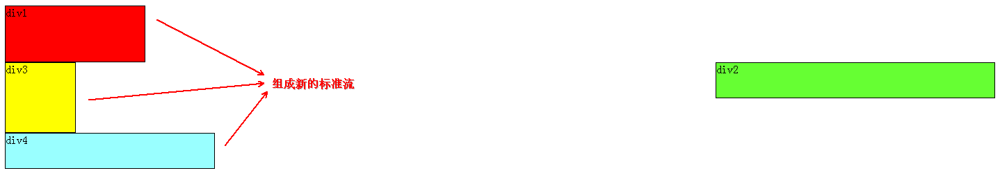
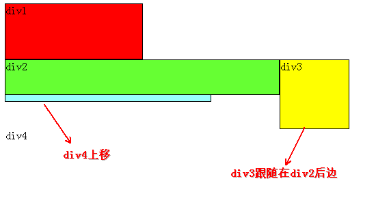

## CSS浮动(float,clear)通俗讲解

### 写在面的话：

由于CSS内很多，精力有限，没有办法从头尾讲一遍，只能有针对性的讲解，如果理解CSS盒子模型，但对于浮动不理解，那么本书可以帮助你。本文以div元素布局为例。

---

### 教程开始

首先要知道，`div`是块级元素，在页面中独占一行，自上而下排列，也就是传说中的流，如下图：

可以看出，即使`div1`的宽度很小，页面中一行可以容下`div1`和`div2`，`div2`也不会排在`div1`后边，因为`div`元素是独占一行的。

注意，以上这些理论，是批标准流中的`div`。

无论多么复杂的布局，其基本的出发点均是：**如何在一行显示多个`div`元素**。

显然标准流已无法满足需求，这就需要用到浮动。

**浮动可以理解为让某`div`元素脱离标准流，漂浮在标准流之上，和标准流不是一个层次**。

如，假设上图中的`div2`浮动，那么它将脱离标准流，但`div1`、`div3`、`div4`仍然在标准流中，所以`div3`会自动向上移动，占据`div2`原来的位置，重新组成一个流，如下图:

从图中可以看出，由于`div2`设置浮动，因此它不再属于标准流，`div3`自动上移顶替`div2`的位置，`div1`、`div3`、`div4`依次排列，成为一个新的流。又因为浮动是漂浮在标准流之上的，因此`div2`档住了一部分`div3`，`div3`看起来变**矮**了。

这里`div2`用的是左浮动（`float:left;`），可以理解为漂浮起来后靠左排列，右浮动（`float:right;`）当然就是靠右排列。这里的靠左、靠右是说页面的左、右边缘。

如果我们把`div2`采用右浮动，会是如下效果：

此时`div2`靠页面右边缘排列，不再遮挡`div3`，读者可以清晰的看到上面所讲的`div1`、`div3`、`div4`组成的流。

 目前为止我们只浮动了一个div元素，多个呢？
 下面我们把`div2`和`div3`都加上左浮动，效果如图：
 
 同理，由于`div2`、`div3`浮动，它们不再属于标准流，因此`div4`会自动上移，与`div1`组成一个“新”标准流，而浮动是漂浮在标准流之上，因此`div2`又挡住了`div4`。
 
 到重点了，当同时对`div2`、`div3`设置浮动之后，`div3`会跟随在`div2`之后，不知道读者有没有发现，一直到现在，`div2`在每个例子中都是浮动的，但并没有跟随到`div1`之后。因此，我们可以得出一个重要结论：
 
>假如某个div元素A是浮动的，如果A元素上一个元素也是浮动的，那么A元素会跟随在上一个元素的后边(如果一行放不下这两个元素，那么A元素会被挤到下一行)；如果A元素上一个元素是标准流中的元素，那么A的相对垂直位置不会改变，也就是说A的顶部总是和上一个元素的底部对齐。