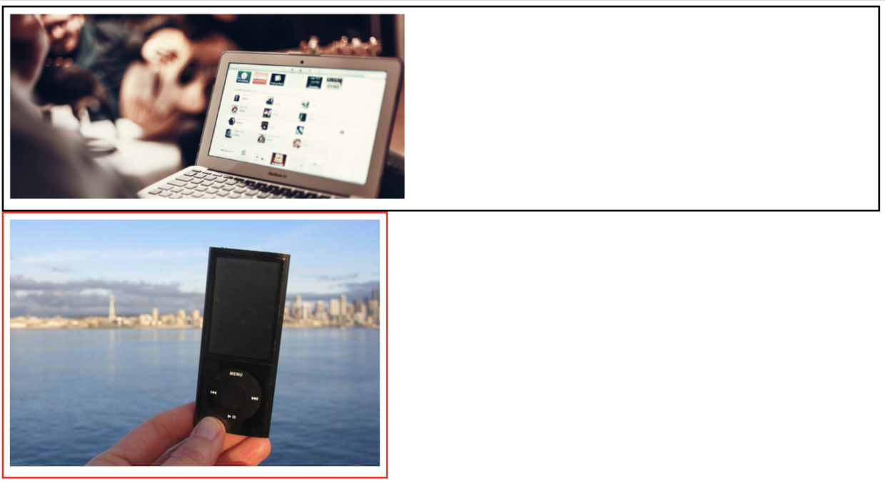

## CSS float相关详解

>float属性是CSS常用的一个属性，应用场景广泛，同时也是一个难点，涉及到一些相关细节及注意点。因此，就特别整理总结一下。


---

### 一、float介绍

float元素也称为浮动元素，设置了float属性的元素会根据属性值向左或向右浮动。浮动元素会从普通文档流中脱离，但浮动元素影响的不仅是自己，它会影响周围的元素对齐进行环绕。简单来说，就是让block元素无视float元素，让inline元素让流水一样围绕着float元素来实现浮动布局。
文字环绕图片是float典型的应用场景，如下所示：


html代码
```html

<p class="around">Harry Potter is a series of fantasy novels written by British author J. K. Rowling. The novels chronicle the life of a young wizard, Harry Potter, and his friends Hermione Granger and Ron Weasley, all of whom are students at Hogwarts School of Witchcraft and Wizardry. </p>
```
css代码
```css
.float{
	float:left;
	margin: 10px;
	width: 100px;
	height: 100px;
}
.around {
	background: #00ff90;
	width:300px;
	padding: 10px;
}
```

由上图可以看出，`img`元素设置了`float：left;`之后会脱离文档流而居于左侧存在。而`p`元素无视`img`元素的存在，从窗口的左上角开始流入，但是`p`元素中的文字意识到`img`元素的存在而环绕图片流入。并且`img`元素是漂浮在`p`元素的上层。

---

### 二、float元素特性

1. 块级框

不管一个元素是行内元素还是块级元素，如果被设置了浮动，那浮动元素会生成一个块级框，可以设置它的`width`和`height`，因此`floa`t常常用于制作横向配列的菜单，可以设置大小并且横向排列。

首先看一个块级元素的例子。

