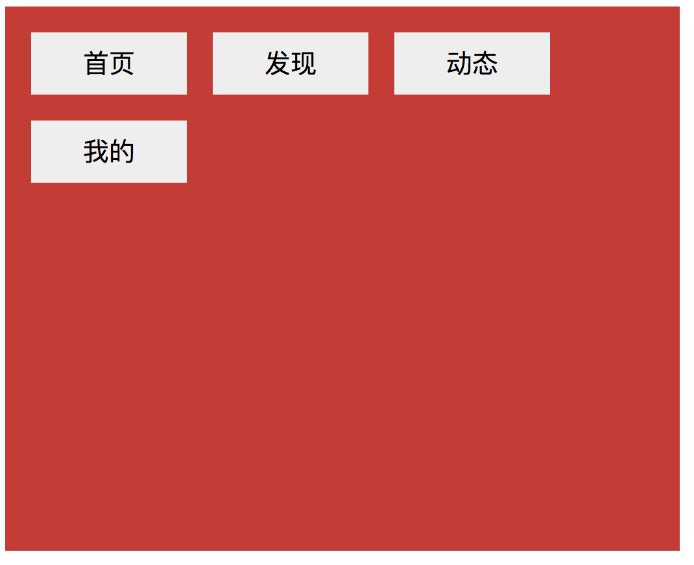

## CSS float相关详解

>float属性是CSS常用的一个属性，应用场景广泛，同时也是一个难点，涉及到一些相关细节及注意点。因此，就特别整理总结一下。


---

### 一、float介绍

float元素也称为浮动元素，设置了float属性的元素会根据属性值向左或向右浮动。浮动元素会从普通文档流中脱离，但浮动元素影响的不仅是自己，它会影响周围的元素对齐进行环绕。简单来说，就是让block元素无视float元素，让inline元素让流水一样围绕着float元素来实现浮动布局。
文字环绕图片是float典型的应用场景，如下所示：


html代码
```html

<p class="around">Harry Potter is a series of fantasy novels written by British author J. K. Rowling. The novels chronicle the life of a young wizard, Harry Potter, and his friends Hermione Granger and Ron Weasley, all of whom are students at Hogwarts School of Witchcraft and Wizardry. </p>
```
css代码
```css
.float{
	float:left;
	margin: 10px;
	width: 100px;
	height: 100px;
}
.around {
	background: #00ff90;
	width:300px;
	padding: 10px;
}
```

由上图可以看出，`img`元素设置了`float：left;`之后会脱离文档流而居于左侧存在。而`p`元素无视`img`元素的存在，从窗口的左上角开始流入，但是`p`元素中的文字意识到`img`元素的存在而环绕图片流入。并且`img`元素是漂浮在`p`元素的上层。

---

### 二、float元素特性

1 . 块级框

不管一个元素是行内元素还是块级元素，如果被设置了浮动，那浮动元素会生成一个块级框，可以设置它的`width`和`height`，因此`floa`t常常用于制作横向配列的菜单，可以设置大小并且横向排列。

首先看一个块级元素的例子。

html代码
```html
    <div class="div1">
		
	</div>
	<div class="div2">
		
	</div>
```
css代码
```css
.div1{
	padding: 10px;
	border: 3px solid black;
}
.div2 {
	float: left;
	padding:10px;
	border: 3px solid red;
}
```
默认情况下，`div`元素的宽是100%，一旦让该`div`浮动起来，立刻会像`inline`元素一样产生包裹性，宽度会跟随内容自适应。

再来看下行内元素的例子：

html代码
```html
	<div class="box">
        <span class="rule1">
            首页
        </span>
        <span class="rule1">
            发现
        </span>
        <span class="rule1">
            动态
        </span>
        <span class="rule1">
            我的
        </span>
    </div>
```
css代码
```css
.box { 
	background: #d32d2d; 
	padding: 10px; 
	width: 500px; 
	height: 400px; 
}
.rule1 { 
	float: left; 
	margin: 10px; 
	padding: 10px; 
	background: #eee; 
	width: 100px; 
	text-align: center; 
}
```
由上图发现，当`span`设置`float`属性后，可以指定`width`，`heigh`t值。 同时可以发现，当多个元素指定为`float`且同时为`left/righ`t时，元素是紧挨着排列，行内宽度不够时再换行排列。

2 . 高度崩塌

html代码
```html
    <div class="div1">
	
    </div>
    <div class="div2">
	
    </div>
```
css代码
```css
.div1{
	padding: 10px;
	border: 3px solid black;
}
.div2 {
	border: 3px solid red;
}
.div2 img {
	float: left;
	padding:10px;
} 
```
将`float`属性设置给`div2`内部的`img`元素，可以看出`div2`的高度并没有`img`元素被撑起来，因此又叫**高度崩塌**。 因为将`img`元素设置为浮动元素，所以脱离文档流。因而`div2`中认为没有元素，所以产生了高度崩塌。具体怎么解决高度崩塌，后面再介绍。

---

### 三、clear属性

clear属性的作用是清除浮动。
```css
  clear : none | left | right | both

   取值：

   none  :  默认值。允许两边都可以有浮动对象

   left   :  不允许左边有浮动对象

   right  :  不允许右边有浮动对象

   both  :  不允许有浮动对象

```

html代码
```html
    <div class="div1">
    </div>
    <div class="div2">
    </div>
```
css代码
```css
.div1{
	float: left;
	width: 300px;
	height: 150px;
	padding: 10px;
	border: 3px solid black;
	background-image: url("image1.jpg")
}
.div2 {
	border: 3px solid red;
	padding:10px;
	width:500px;
	height:200px;
	background-image: url("image2.jpg")
}
```
如上图所示，由于`div1`是浮动元素，所以`div2`在`div1`底层铺展。 如果想要让`div2`换行排列，居于`div1`底端下方，这个时候就要用到`clear`属性了。

css代码
```css
.div1{
	float: left;
	width: 300px;
	height: 150px;
	padding: 10px;
	border: 3px solid black;
	background-image: url("image1.jpg")
}
.div2 {
        clear: left;
	border: 3px solid red;
	padding:10px;
	width:500px;
	height:200px;
	background-image: url("image2.jpg")
}
```
只需要在`div2`中加入`clear: left;`。

>对于CSS的清除浮动(clear)，一定要牢记：这个规则只能影响使用清除的元素本身，不能影响其他元素。


