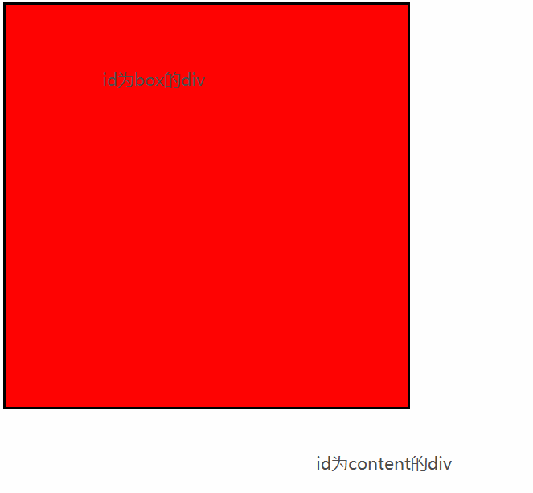
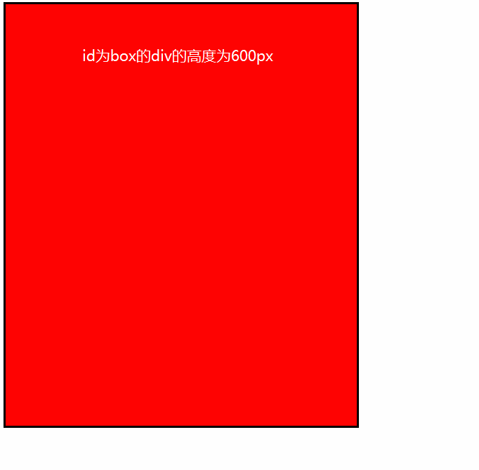

## 直接上代码

```html
<!DOCTYPE html>
<html lang="en">
<head>
	<meta charset="UTF-8">
	<title>Document</title>
	<style type="text/css">
#box{ 
          width:500px; 

          background:#000; 

          height:500px;
          /*overflow: hidden;*/
          border: 3px solid black;

 } 

#content { 

          float:left; 

          width:600px; 

          height:600px; 

          background:red;

 } 
	</style>
</head>
<body>

	<div id="box">
		<div id="content"></div>
	</div>
	
</body>
</html>
```
如下图：


给`box`这个`div`加了一个`overflow:hidden`这个属性解决了这个问题。我们知道`overflow:hidden`这个属性的作用是隐藏溢出，给`box`加上这个属性后，我们的`content` 的宽高自动的被隐藏掉了。

```html
<!DOCTYPE html>
<html lang="en">
<head>
	<meta charset="UTF-8">
	<title>Document</title>
	<style type="text/css">
#box{ 
          width:500px; 

          background:#000; 

          height:500px;
          overflow: hidden;
          border: 3px solid black;

 } 

#content { 

          float:left; 

          width:600px; 

          height:600px; 

          background:red;

 } 
	</style>
</head>
<body>

	<div id="box">
		<div id="content"></div>
	</div>
	
</body>
</html>
```


另外，我们再做一个试验，将box这个div的高度值删除后，我们发现，box的高度自动的被content 这个div的高度值给撑开了。

```html
<!DOCTYPE html>
<html lang="en">
<head>
	<meta charset="UTF-8">
	<title>Document</title>
	<style type="text/css">
#box{ 
          width:500px; 

          background:#000; 

          /*height:500px;*/
          overflow: hidden;
          border: 3px solid black;

 } 

#content { 

          float:left; 

          width:600px; 

          height:600px; 

          background:red;

 } 
	</style>
</head>
<body>

	<div id="box">
		<div id="content"></div>
	</div>
	
</body>
</html>
```



说到这里，我们再来理解一下“浮动”这个词的含义。我们原先的理解是，在一个平面上的浮动，但是通过这个试验，我们发现，这不仅仅是一个平面上的浮动，而是一个立体的浮动！

也就是说，当`content` 这个`div`加上浮动这个属性的时候，在显示器的侧面，它已经脱离了`box`这个`div`，也就是说，此时的`content` 的宽高是多少，对于已经脱离了的`box`来说，都是不起作用的。当我们全面的理解了浮动这个词的含义的时候，我们就理解`overflow:hidden`这个属性中的解释，清除浮动是什么意思了。也就是说，当我们给`box`这个`div`加上`overflow:hidden`这个属性的时候，其中的`content`等等带浮动属性的`div`的在这个立体的浮动已经被清除了。这就是`overflow:hidden`这个属性清除浮动的**准确含义**。当我们没有给`box`这个`div`设置高度的时候，`content` 这个`div`的高度，就会撑开`box`这个`div`，而在另一个方面，我们要注意到的是，当我们给`box`这个`div`加上一个高度值，那么无论`content` 这个`div`的高度是多少，box这个高度都是我们设定的值。而当content 的高度超过box的高度的时候，超出的部分就会被隐藏。这就是隐藏溢出的含义！