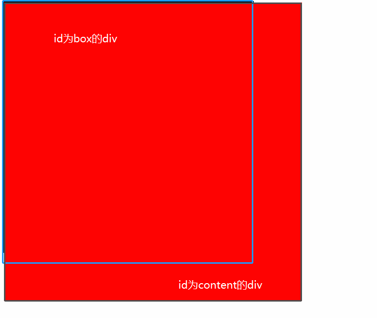

## 直接上代码

```html
<!DOCTYPE html>
<html lang="en">
<head>
	<meta charset="UTF-8">
	<title>Document</title>
	<style type="text/css">
#box{ 
          width:500px; 

          background:#000; 

          height:500px;
          /*overflow: hidden;*/
          border: 3px solid black;

 } 

#content { 

          float:left; 

          width:600px; 

          height:600px; 

          background:red;

 } 
	</style>
</head>
<body>

	<div id="box">
		<div id="content"></div>
	</div>
	
</body>
</html>
```
如下图：

